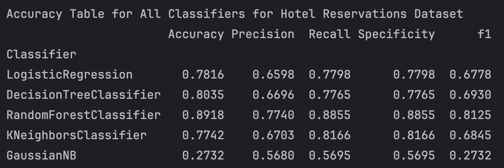
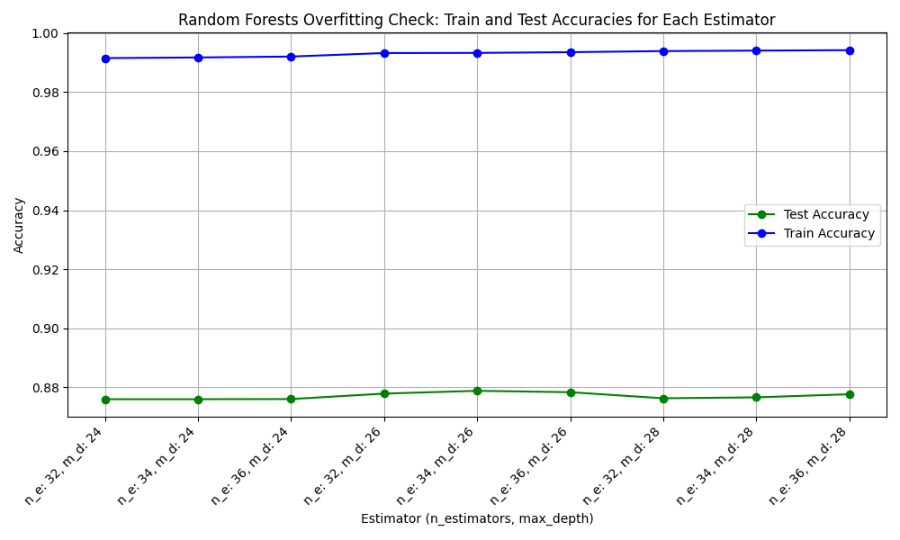

# Classification in Machine Learning Project
Classification is a supervised machine learning method where the model tries to predict the 
correct label of a given input data. In classification, the model is fully trained using 
the training data, and then it is evaluated on test data before being used to perform 
prediction on new unseen data.
### Dataset and it's Features
Can you predict if customer is going to cancel the reservation ?\
A significant number of hotel reservations are called-off due to cancellations or no-shows. The typical reasons 
for cancellations include change of plans, scheduling conflicts, etc. This is often made easier by the option 
to do so free of charge or preferably at a low cost which is beneficial to hotel guests, but it is a less desirable 
and possibly revenue-diminishing factor for hotels to deal with.\

A [Kaggle Hotel Reservations Dataset](https://www.kaggle.com/datasets/ahsan81/hotel-reservations-classification-dataset)\ 
is used for the project. It has **36275 entries, 19 columns**. One of them (booking_status) is the _target column_, 
_12 features columns_ with data type of integer or float and _4 features columns_ with data type of object. One 
column - Booking_ID - was dropped.\
### Data Correlation
**Data Correlation** (a statistical indicator that quantifies the degree to which two variables change in relation to each 
other) of the Dataset *does not show clear correlation* between data columns, except two minor dependencies:\
- no_of_previous_bookings_not_canceled / repeated_guest - 0,54
- avg_price_per_room / room_type_reserved - 0,47
- lead_time / booking_status - -0,44
After removing these tree features from dataset result was 0.8624 for Logistic Regression and 0.8414 for Random Forest. 

### Dataset Balancing
**Dataset is unbalanced** - initial train data class distribution is 19512 for not canceled bookings to 9508 
canceled bookings.
After *Target Class Balancing* class distribution is as follows:

### Data Normalization
Min-Max scaling and Z-score normalization (standardization) are the two fundamental techniques 
for normalization.
### Classification Algorithms Evaluated
- Logistic Regression
- Decision Tree
- Random Forests
- K-Nearest Neighbours
- Naive Bayes
### Models Evaluation Metrics used
**Accuracy:** The proportion of correctly classified instances over the total number 
of instances in the test set.\
**Precision:** Precision measures the proportion of true positives over the total number of predicted positives.\
**Recall:** Recall measures the proportion of true positives over the total number of actual positives.\
**Specificity:** Specificity measures how well the model can correctly identify instances of the negative class.\
**F1-Score:** The harmonic mean of precision and recall, calculated as 2 x (precision x recall) / (precision + 
recall).\
**Confusion matrix:** A table that shows the number of true positives, true negatives, false positives, 
and false negatives for each class, which can be used to calculate various evaluation metrics.\
**Cross-validation:** A technique that divides the data into multiple folds and trains the model on each fold 
while testing on the others, to obtain a more robust estimate of the model’s performance.
### Initial Evaluation results
Classifiers Performance Metrics on Hotel Reservations Dataset are:

### Models fitting
Two models were fitted: Logistic Regression and Random Forest Classifier.
### Logistic Regression
The certain set of a thresholds was used to find the best threshold for the Logistic Regression model:

The best fitted threshold and corresponding accuracy is:

### Random Forests
Initially 3 parameters for a model tuning was used: n_estimators, max_depth and bootstrap. 

Later additional 4 params were introduced: min_samples_split, min_samples_leaf, max_features, criterion.
The GridSearch Cross Validation method was used to find the best parameters for the Random Forest model:

### Overfitting Check

### Features Importance

### Final Results
| Model               | Accuracy          | Overfitting distance |
|---------------------|-------------------|----------------------|
| Logistic Regression | 0.8857            | 0,2317               |
| Random Forests      | 0.8928            | 0,1                  |
### Project status
Way forward:
- Check for data correlation (+).
- Features normalisation (+).
- Check for model overfitting (+).
- Evaluate feature importance (+).
- Introduce more params fo Random Forest model (+).
### Contributing
Contributions are welcome! Please open an issue or submit a pull request if you have any improvements or bug fixes.
### Resources
[Kaggle Hotel Reservations Dataset Link](https://www.kaggle.com/datasets/ahsan81/hotel-reservations-classification-dataset)
### License
This project is licensed under the MIT License.
