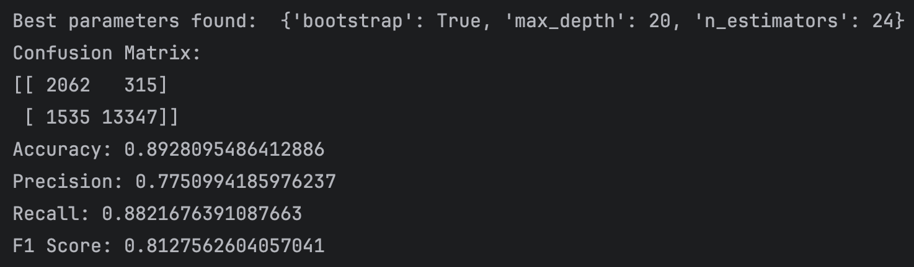

# Machine Learning Classification
Can you predict if customer is going to cancel the reservation ?
Classification in machine learning consists of mathematical methods that allow data scientists to predict a continuous outcome (y) based on the value of one or more predictor variables (x).
For Hotel Reservations Dataset
# Classification Algorithms
The online hotel reservation channels have dramatically changed booking possibilities and customers’ behavior. A significant number of hotel reservations are called-off due to cancellations or no-shows. The typical reasons for cancellations include change of plans, scheduling conflicts, etc. This is often made easier by the option to do so free of charge or preferably at a low cost which is beneficial to hotel guests but it is a less desirable and possibly revenue-diminishing factor for hotels to deal with.
## Logistic Regression
The accuracies for each threshold

## Decision Tree Classifier

## Random Forest Classifier
GridSearchCV (Cross Validation)

## K Neighbors Classifier

## GaussianNB

# Results
Classifier Performance Metrics on Hotel Reservations Dataset:

## Project status
Way forward:
- Improve Error handling.
- Implement State Management.
- Enhance analytics with more charts.
## Contributing
Contributions are welcome! Please open an issue or submit a pull request if you have any improvements or bug fixes.
## Resources
[Data Set Link](https://www.kaggle.com/datasets/ahsan81/hotel-reservations-classification-dataset)
## License
This project is licensed under the MIT License.